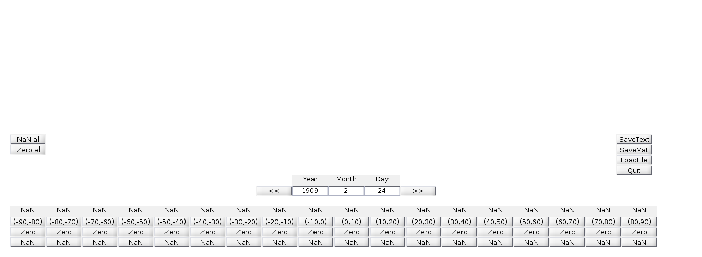

# Facular Counter

Matlab base tool for storage latitude positions of Solar Faculae as a matrix in which the rows are the dates of the observed data and the columns are latitude intervals 10 grades long, data is gather inside a matrix as output in .m and .txt format

## Getting Started

Program Interface, from left to right :
#### Reset buttons
NAN all: puts all the inputs as NAN value\\
Zero all : puts all the inputs as zero value

#### Navegation Panel
In the middle of the interface, shows the date in which the data will be recorded, the date can be changed by directly introducing it or by tweaking it using the navigation buttons  (going from 1ts of january of 1883 to 31st of december of 1930)

#### Administration buttons
SaveTex : Save the matrix as a .txt file
SaveMat : Save the matrix as a .m file
LoadFile : Loads previous .m file
Quit : Exit the user from the aplication generating a backup file automatically

#### Counting Panel
Here 

### Prerequisites

Facular_Counts.m needs 3 backup files (provided with the code) and Matlab's 2016 version or higher 

## Built With

* [Dropwizard](http://www.dropwizard.io/1.0.2/docs/) - The web framework used
* [Maven](https://maven.apache.org/) - Dependency Management
* [ROME](https://rometools.github.io/rome/) - Used to generate RSS Feeds

## Contributing

Please read [CONTRIBUTING.md](https://gist.github.com/PurpleBooth/b24679402957c63ec426) for details on our code of conduct, and the process for submitting pull requests to us.

## Versioning

We use [SemVer](http://semver.org/) for versioning. For the versions available, see the [tags on this repository](https://github.com/your/project/tags). 

## Authors

* **Billie Thompson** - *Initial work* - [PurpleBooth](https://github.com/PurpleBooth)

See also the list of [contributors](https://github.com/your/project/contributors) who participated in this project.

## License

This project is licensed under the MIT License - see the [LICENSE.md](LICENSE.md) file for details

## Acknowledgments

* Hat tip to anyone whose code was used
* Inspiration
* et

